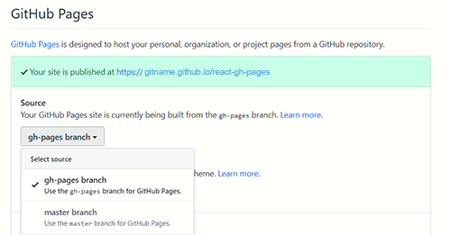

## GitHub Pages Deployment Instructions for a React App

#### Step 1: Add homepage to package.json

* At the top level of the  package.json file, add a `homepage` property. Define its value to be the string `http://{username}.github.io/{repo-name}`, where `{username}` is your GitHub username, and `{repo-name}` is the name of the GitHub repository you created for this project. For this example, GitHub username is: `gitname` and the name of the GitHub repository is: `react-gh-pages`:
    
    ```js
    //...
    "homepage": "http://gitname.github.io/react-gh-pages"

    ```

#### Step 2: Add "predeploy" and "deploy" to scripts in package.json

  * In the existing `scripts` property, add a `predeploy` property and a `deploy` property, each having the values shown below:

    ```js
    "scripts": {
      //...
      "predeploy": "npm run build",
      "deploy": "gh-pages -d build"
    }
    ```

#### Step 3: Install gh-pages

  ```
    $ npm install --save gh-pages
  ```

#### Step 4: Deploy the site by running npm run deploy
  ```
    $ npm run deploy
  ```

#### Step 5: Ensure your project’s settings use gh-pages




If you need more information on deploying your React app, click this link: https://facebook.github.io/create-react-app/docs/deployment